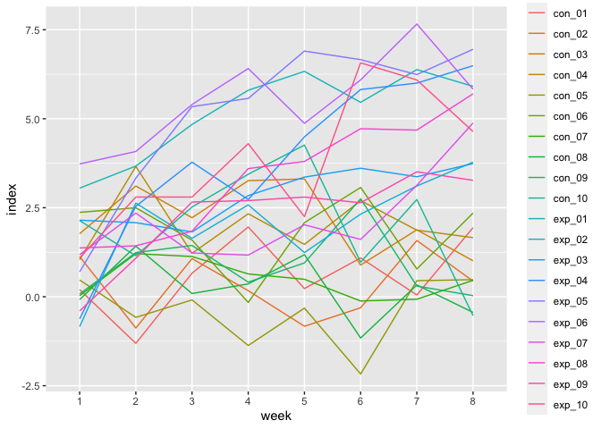

p8105_hw5_jz3573
================
Jiangyuan Zhu
2023-11-15

# Question 2

## Make a dataframe

read the names of files.

``` r
path_list=list.files(path = "./data" , full.names = TRUE ) 
```

input the context

``` r
context=purrr::map(path_list, read.csv) %>% 
bind_rows()  %>% 
round(digits = 2)
```

input the names

``` r
name_df=list.files(path = "./data")  %>% 
  file_path_sans_ext %>% 
  data_frame()
```

    ## Warning: `data_frame()` was deprecated in tibble 1.1.0.
    ## ℹ Please use `tibble()` instead.
    ## This warning is displayed once every 8 hours.
    ## Call `lifecycle::last_lifecycle_warnings()` to see where this warning was
    ## generated.

combine the files and add a column name

``` r
full_df = bind_cols(name_df, context) 
  
names(full_df) [1]="id"
```

make it a computer-readable dataframe

``` r
full_tidy_df = 
  pivot_longer(
    full_df, 
    week_1:week_8,
    names_to = "week", 
    names_prefix = "week_",
    values_to = "index")
```

## Make a plot

``` r
full_tidy_df %>% 
ggplot(aes(x=week , y=index, group = id, color = id))  + geom_line()
```

<!-- -->

According to the plot, the experience groups have higher value than the
control groups over weeks.

# Problem 3

## create 5000 datasets

``` r
set.seed(1)

output = vector("list", 5000)
for (i in 1:5000) {
  output[[i]] = rnorm(30,0,5 )
}
```

## create a dataframe save 5000 μ̂ and p-value

``` r
output_si = vector ("list", 5000)

for (i in 1:5000){
output_si[[i]]= t.test(output[[i]], conf.level = 0.05 ) %>%
  broom::tidy() %>% 
  select(estimate, p.value) 
}

sim_result = bind_rows(output_si)

set.seed(1)
```

## create a function and repeat it for μ={1,2,3,4,5,6}

``` r
sim_power = function(mu) {
  
  data = tibble(
    x = rnorm(n = 30, mean = mu, sd = 5)
  )
  
  output = data %>%  
    t.test() %>% 
    broom::tidy() %>% 
    select(estimate, p.value) 
}

sim_power_results = expand_grid(
  mu_df = c(0, 1, 2, 3, 4, 5, 6), 
  iteration = 1:5000
) %>% 
  mutate(
    estimate = map(mu_df, sim_power)
  )  %>% 
  unnest(estimate)

set.seed(1)
```

## make the plot of effect-size and power

``` r
sim_power_results %>%  
  group_by(mu_df) %>%  
  summarize(
    reject = sum(p.value < 0.05), 
    proportion = reject / 5000
  ) |> 
  ggplot(aes(x = mu_df, y = proportion)) +
  geom_line() +
  labs(title = "Power Simulation ")
```

<!-- -->

As the mu_df increase , it gets away from the value in null hypothesis,
so the propotion to reject null hypothesis increases. In another word,
as the effect size increase, the power increases.

## make the second plot

calculate the mean of μ̂ among all data

``` r
mean_mu_df =
  sim_power_results |> 
  group_by(mu_df) |> 
  summarize(mean_mu = mean(estimate))
```

calculate the mean of μ̂ among all data among those rejecting hypothesis

``` r
reject_mu_df = 
  sim_power_results |> 
  filter(p.value < 0.05) |> 
  group_by(mu_df) |> 
  summarize(mean_mu = mean(estimate))
```

make the plot

``` r
ggplot(mean_mu_df, aes(x = mu_df, y = mean_mu)) +
  geom_line() +
  geom_line(data = reject_mu_df, color= "red") +
  labs(title = "Comapring the True μ to Rejected μ")
```

<!-- -->

The red line illustrate the mean of mu for those reject null hypothesis.
And the black line represent the mean of mu for all data. The red line
is above black line from 0 to 4, which means that the mean of mu is
larger for those in reject null hypothesis than overall datasets.
